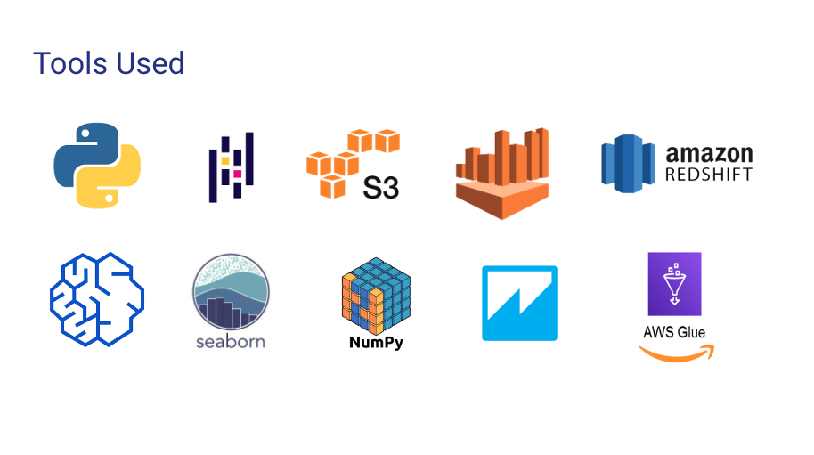

# Data Science in the Cloud

 For the Capstone Project I wanted to concentrate on utilizing of what I have learned as a part of the school in terms of using tools for data analysis and what Amazon as one of the providers offers in terms of services for data science - therefore my project title is Data Science in the Cloud.

## Problem Statement, Motivation and Purpose

Main motivation for this work is basically recent fast forward automation that we are seeing in IT that can impact time of project execution as well as cost. So some of the problems identified  are:

- Manual Sorting, transformation and processing of data sets
- Lack of enterprise infrastructure to systemically and in an automated fashion create end to end pipeline
- Displaying different analytics on custom dashboard as a part of single pane of glass representation

## About Data Set 

Customer Reviews are one of the Amazon’s most valuable tools for customers looking to make informed purchase decision. The dataset is shared in a public Amazon S3 bucket  [Amazon Product Reviews -  Data Set Source](https://s3.amazonaws.com/amazon-reviews-pds/readme.html)
Amazon Customer Reviews (a.k.a. Product Reviews) is one of Amazon’s iconic products. In a period of over two decades since the first review in 1995, millions of Amazon customers have contributed over a hundred million reviews to express opinions and describe their experiences regarding products on the Amazon.com website. This makes Amazon Customer Reviews a rich source of information for academic researchers in the fields of Natural Language Processing (NLP), Information Retrieval (IR), and Machine Learning (ML), amongst others. Accordingly, we are releasing this data to further research in multiple disciplines related to understanding customer product experiences. Specifically, this dataset was constructed to represent a sample of customer evaluations and opinions, variation in the perception of a product across geographical regions, and promotional intent or bias in reviews.

The dataset contains the customer review text with accompanying metadata, consisting of two major components:

- A collection of reviews written in the Amazon.com marketplace and associated metadata from 1995 until 2015. This is intended to facilitate study into the properties (and the evolution) of customer reviews potentially including how people evaluate and express their experiences with respect to products at scale. (130M+ customer reviews)
- A collection of reviews about products in multiple languages from different Amazon marketplaces, intended to facilitate analysis of customers’ perception of the same products and wider consumer preferences across languages and countries. (200K+ customer reviews in 5 countries)

Data Formats
The dataset is currently available in two file formats.

- Tab separated value (TSV), a text format - s3://amazon-reviews-pds/tsv/
- Parquet, an optimized columnar binary format - s3://amazon-reviews-pds/parquet/

To further improve query performance the Parquet dataset is partitioned (divided into subfolders) on S3 by product_category. This allows for queries using a WHERE clause on product_category to only read data specific to that category.

## Tools & Methods

The tools that were used for the project are: 

- Python
- Pandas
- S3
- AWS Athena
- AWS Redshift
- AWS Sagemaker
- Seaborn
- Numpy
- QuickSight
- AWS Glue

